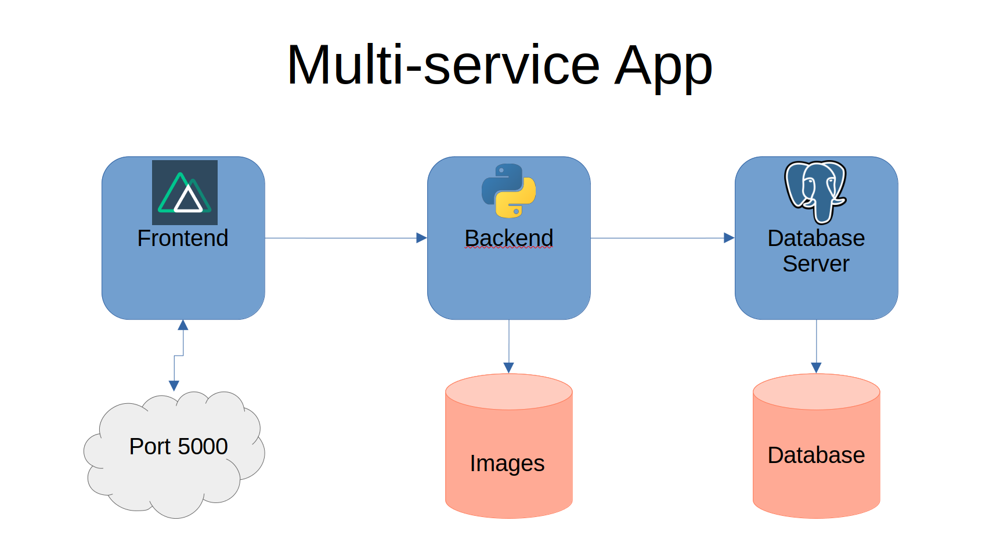

# Containers 101 - Part X: Introducing Docker Compose

# Introduction

In [SlimDevOps Episode 14](https://www.youtube.com/watch?v=7oIb3NGXqps) we
demonstrated how to use volumes with Docker to persist application data. Today
we're taking that same [Photo App](./pyphotoapp/) and introducing [docker-compose](https://docs.docker.com/compose/)
to the build process. This is our step first towards migrating our app to a
multi-service container group.

## Dockerfile

We've tweaked the Docker file, just a little, to add some of the best practice
we've learned.

```Dockerfile
FROM python:3.9.7

WORKDIR /app
COPY --chown=www-data . .
RUN pip install -r requirements.txt

USER www-data
EXPOSE 5000
ENTRYPOINT ["python", "app.py"]
```

## Persistent data store

Let's create directories for our app to persist data. We need somewhere for the
images and the database file.

```bash
sudo mkdir -p /srv/photo/{images,data}
sudo chown -Rv www-data:www-data /srv/photo
```

### Build & Run with Docker

Build the container image.

```bash
docker build -t pyphotoapp_webapp:docker .
```

Run the container image, map the ports and mount the volumes.

```bash
docker run -it --rm \
  -p 5000:5000 \
  -v /srv/photo/images:/app/static/images \
  -v /srv/photo/data:/app/data pyphotoapp_webapp:docker
```

## Adding docker-compose.yml

Using Compose is basically a three-step process:

  1 Define your app environment with a `Dockerfile`
  2 Define the services that make up your app in `docker-compose.yml` so they can be run together in an isolated environment.
  3 Run `docker-compose up` to start and run your entire app.

The Compose file is a YAML file defining services, networks, and volumes for a
Docker application. There are [several versions of the Compose file format](https://docs.docker.com/compose/compose-file/compose-versioning/) – 1, 2, 2.x, and 3.x. We're using the latest, 3.8.

```yaml
version: '3.8'

services:
  photoapp:
    build: .
    ports:
      - "5000:5000"
    volumes:
      - /srv/photo/images:/app/static/images
      - /srv/photo/data:/app/data
```

### Build & Run with Compose

```bash
docker-compose up
```

### Run is detached mode

If you want to run your services in the background, you can pass the `-d` flag
(for "detached" mode) to `docker-compose up` and use `docker-compose ps` to see
what is currently running:

If you started Compose with `docker-compose up -d`, stop your services once
you've finished with them:

`stop` stops running containers without removing them. They can be started again
with `docker-compose start`.

```bash
docker-compose stop
```

You can bring everything down, removing the containers entirely, with the `down`
command. `down` stops containers and removes containers, networks, volumes, and
images created by `up`.

```bash
docker-compose down
```

# Next Steps

## What we have


## What we'll make



