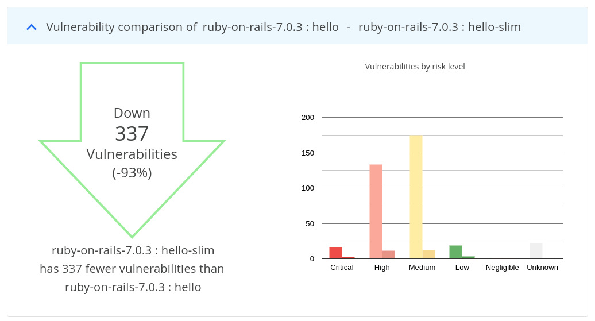
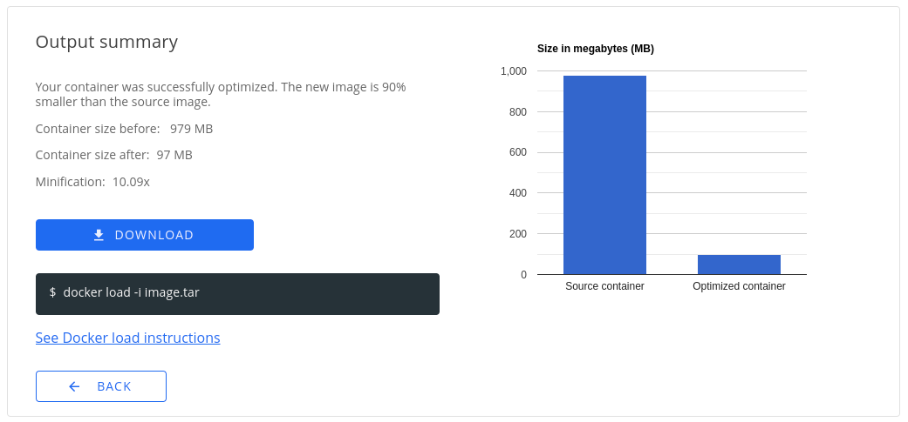

# Slim Starter Pack: Ruby 'Hello World' API Only Version
[](https://www.slim.ai/)
[](https://hub.docker.com/)

Hello Ruby developers! 

Optimize and harden your containerized applications the easy way — with Slim.AI. 

This Starter Kit will help you proactively remove vulnerabilities from your applications. 

Simply replace the application code here with your own application, run it through Slim.AI's [automated container optimization](https://www.slim.ai/docs/optimization) process, and you'll remove up to 90-percent of the image's vulnerabilities while also making it up to 30X smaller. 

No more chasing down hard to patch vulns that your application isn't even using, and you can use any base image you want — even `ruby:latest`. 

# Optimization Results


Slimming this Rails container results in 100-percent reduction in overall vulnerabilities. 

## Vulnerability difference by severity 

[See the full report.](https://www.slim.ai/starter-kits/python)

# Get Started
To start a Rails application application, you'll need the following libraries installed locally, or running in a dev environment link GitPod, Docker Environments, or Code Spaces. 


``` 
ruby 3.1.2
rails ~> 7.0.3
```

To run locally use:
```
bundle install
RAILS_ENV=development bundle exec rails s -p 3000 -b '0.0.0.0'
```
While using docker:

set ```RAILS_ENV``` as required.

update ```bin/start``` to switch between puma and rails server.
## Sample Application
Our sample application is a simple REST API that merely returns "Hello World!".

While this app is simple, it's a great starting point for more complex development. 

Important Project structure
```
Dockerfile
|- app
|-- channels
|-- controllers
|---- concerns
|---- application_controller.rb
|---- hello_controller.rb
|-- jobs
|-- mailers
|-- models
|-- views
|- config
|-- routes.rb
|- test
|-- channels
|-- controllers
|-- fixtures
|-- integration
|-- mailers
|-- models
|-- test_helper.rb
```

Code sample
``` ruby 
class HelloController < ApplicationController
    def index
        yourip = request.remote_ip
        ruby_version = RUBY_VERSION
        rails_version = Rails::VERSION::STRING
        render json: { hello:"world", yourip:yourip,ruby_version:ruby_version,rails_version:rails_version }
      end
end
```

Replace this placholder code with your own application code, and install any necessary dependencies, to create your own slimmable container. 

## Sample Dockerfile
Our Dockerfile builds off of the `rails:latest` image and starts at **892MB**. The slimming process reduces the size by **27X** to just **97MB**. 



[See the full report on Slim.AI](https://portal.slim.dev/... )