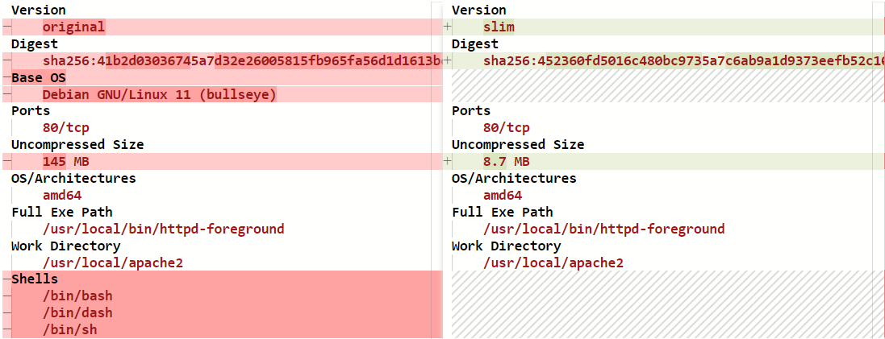
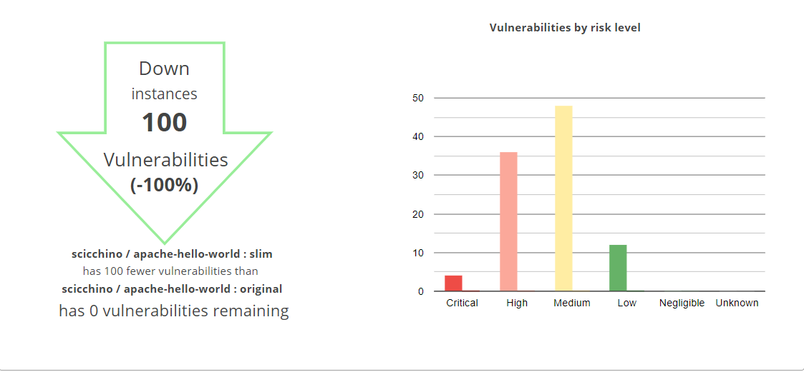

# Slim Starter Pack: Apache
[LINK TO SLIMAI](https://portal.slim.dev/home/profile/dockerhub%3A%2F%2Fdockerhub.public%2Flibrary%2Fhttpd%3Alatest)
[LINK TO IMAGE ON DOCKERHUB](https://hub.docker.com/_/httpd)

Attention Apache developers! 

Optimize and harden your containerized applications the easy way — with Slim.AI. 

This Starter Kit will help you proactively remove vulnerabilities from your applications. 

Simply replace the application code here with your own application, run it through Slim.AI's [automated container optimization](https://www.slim.ai/docs/quickstart) process, and you'll remove up to 90% of the image's vulnerabilities. 

In the setup wizard, be sure to select "/usr/local/apache2/logs/" when it prompts you for files to manually include - this is critical to the server startup.

No more chasing down hard to patch vulns that your application isn't even using. 

# Optimization Results

## Overall results


Slimming this httpd container resulted in a more than 16X minification factor!

## Vulnerability difference by severity 



In the process, we have eliminated all of our detected vulnerabilities!
# Get Started
To start this Apache application, all you will need is a running Docker daemon and a cloned version of this repository. Our sample application is a simple Hello-World Apache web server.
```Dockerfile
|- app
|-- Dockerfile
|-- website
|--- index.html
```

Replace this placeholder code with your own application code, and install any necessary dependencies, to create your own slimmable container. 

## Sample Dockerfile
Our original Dockerfile builds off of the `httpd:2.4` image to create the pre-hardened app.

```Dockerfile
FROM httpd:2.4
COPY ./website/ /usr/local/apache2/htdocs/
```

From there, it's a simple command to run the app and check out the webpage!

```bash
docker run -dp 80:80 <container image name>
```

Just visit localhost:80 to see for yourself.
