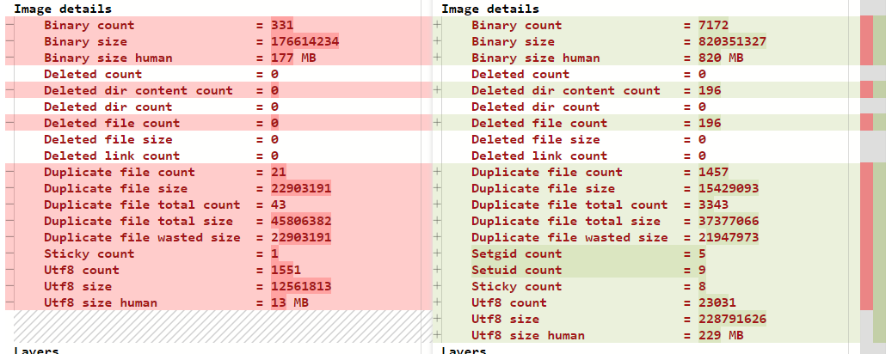

# Slim Starter Pack: Go
[LINK TO SLIMAI](https://portal.slim.dev/home/profile/dockerhub%3A%2F%2Fdockerhub.public%2Flibrary%2Fgolang%3Alatest)
[LINK TO IMAGE ON DOCKERHUB](https://hub.docker.com/_/golang)

Attention Go developers! 

Optimize and harden your containerized applications the easy way — with Slim.AI. 

This Starter Kit will help you proactively remove vulnerabilities from your applications. 

Simply replace the application code here with your own application, run it through Slim.AI's [automated container optimization](https://www.slim.ai/docs/optimization) process, and you'll remove up to 90% of the image's vulnerabilities. 

Be sure to expose your 8080 port in the optimization wizard, and include the file-path /usr/local/go/src/unsafe!

No more chasing down hard to patch vulns that your application isn't even using. 

# Optimization Results


## Overall results


Slimming this Go container results in a **99**% reduction in overall vulnerabilities. 

## Vulnerability difference by severity 


# Get Started
To start this Go application, all you will need is a running Docker daemon and a cloned version of this repository. Our sample application is a simple Hello-World go web server.
```
Dockerfile
|- app
|-- Dockerfile
|-- go.mod
|-- main.go
|-- slim-app.sh
|-- habitat
|---- default.toml
|---- plan.sh
|---- hooks
|----- run

```


Replace this placholder code with your own application code, and install any necessary dependencies, to create your own slimmable container. 

## Sample Dockerfile
Our original Dockerfile builds off of the `Go:19.1.2` image to create a the pre-hardened app.

```Dockerfile
FROM golang:1.19.2

WORKDIR /go/app

ADD . .

RUN go get .

CMD ["go", "run", "main.go"]
```


