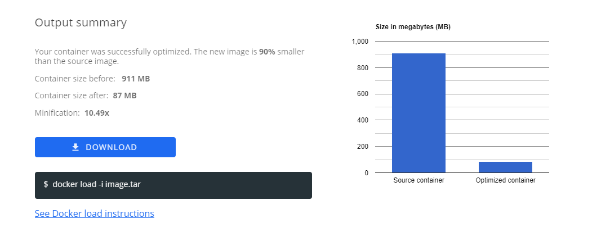

# Slim Starter Pack: Node.js
[LINK TO SLIMAI](https://portal.slim.dev/home/profile/dockerhub%3A%2F%2Fdockerhub.public%2Flibrary%2Fnode%3Alatest)

[LINK TO IMAGE ON DOCKERHUB](https://hub.docker.com/_/node)

Attention Node.js develeopers! 

Optimize and harden your containerized applications the easy way — with Slim.AI. 

This Starter Kit will help you proactively remove vulnerabilities from your applications. 

Simply replace the application code here with your own application, run it through Slim.AI's [automated container optimization](https://www.slim.ai/docs/optimization) process, and you'll remove up to 90% of the image's vulnerabilities. 

No more chasing down hard to patch vulns that your application isn't even using. 

# Optimization Results


## Overall results


Slimming this Node.js container results in a 90% reduction in container size, meaning a significantly reduced attack surface while requiring 0 new code!

## Meta Data difference by severity 


# Get Started
To start this dockerized Node.js application, all you will need is a running Docker daemon. From there, running this app requires just two simple commands executed in the app directory.
  
```bash
  docker build -t node-hw .
  docker run -dp 8080:8080 node-website
```

From there, you can navigate to localhost:8080 on your host machine. 

## Sample Application
Our sample application is a simple “Hello World” Node.js express web server.

```javascript
const express = require('express')
const app = express()
const port = 300

app.get('/', (req, res) => {
 res.send('Hello World!')
})

app.listen(port, () => {
 console.log(`Example app listening at http://localhost:${port}`)
})

```


Replace this placholder code with your own application code and install any necessary dependencies to create your own slimmable container. 

## Sample Dockerfile
Our Dockerfile builds off of the `node:16` base image.
  
  ```Dockerfile
FROM node:latest WORKDIR /usr/src/app 

COPY package*.json ./ 

RUN npm ci 

USER node 

COPY app.js ./ 

EXPOSE 3000 

ENTRYPOINT ["node", "app.js"]
  ```


